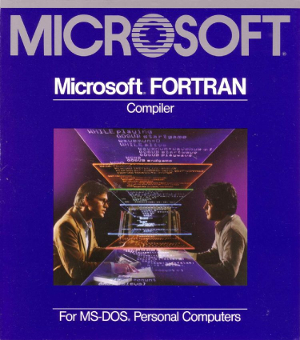

In the mid-1980s, Microsoft FORTRAN was largely compliant with the FORTRAN 77 standard, which utilized a structured, fixed-column source code format.      


## Key FORTRAN 77 Syntax Rules (Mid-1980s)      
- Columns 1-5: Reserved for statement labels (line numbers).
- Column 6: Used for continuation characters (any non-space, non-zero character indicated that the line was a continuation of the previous one).
- Columns 7-72: Contained the actual program statements.
- Columns 73-80: Ignored by the compiler, typically used for sequence numbers.
- Comments: A 'C', '*', or '!' in column 1 marked the line as a comment (though '!' was a later extension and might not be supported by all mid-80s compilers).


### Sample Code (Mid-1980s Microsoft FORTRAN)    

The following code demonstrates a simple program to calculate the area of a circle, using syntax compatible with Microsoft FORTRAN versions of the mid-1980s (e.g., versions 3.2, 3.3, and 4.0). 

```fortran

C     PROGRAM TO CALCULATE THE AREA OF A CIRCLE
C     VARIABLES STARTING WITH I-N ARE INTEGERS BY DEFAULT
C     ALL OTHER STARTING LETTERS ARE REAL NUMBERS BY DEFAULT

      PROGRAM AREA
      REAL RADIUS, AREA, PI
C     EXPLICITLY DECLARE PI AS A PARAMETER (CONSTANT)
      PARAMETER (PI = 3.141592654)

C     PROMPT THE USER FOR INPUT
      WRITE (*,*) 'ENTER THE RADIUS OF THE CIRCLE:'
      READ (*,*) RADIUS

C     CALCULATE THE AREA
      AREA = PI * RADIUS**2

C     DISPLAY THE RESULT
      WRITE (*,*) 'THE AREA IS:', AREA

C     END OF PROGRAM
      END


```

### Sample Code Explanation    

- **PROGRAM AREA**: The start of the main program unit. 
- **REAL RADIUS, AREA, PI**: An explicit type declaration overriding the default implicit typing rules for variables beginning with 'R' or 'P'.
- **PARAMETER (PI = ...)**: Defines PI as a named constant.
- **WRITE(`*`,`*`)**: A standard FORTRAN 77 statement for free-format output to the default output unit (usually the screen). The first `*` refers to the default output unit, and the second `*` specifies list-directed (free-format) I/O.
- **READ (`*`,`*`)**: Reads input from the default input unit (usually the keyboard) in free format.
- **`**2`**: The exponentiation operator.
- **END**: Marks the end of the program unit.


This type of code would typically be compiled using a command-line tool like FL (FORTRAN Optimizing Compiler driver) on an MS-DOS system in the mid-80s. 
